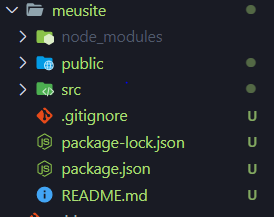

# ReactJs-Introducao

Apredendo a desenvolver Aplicações com React Js

#### Conhecendo Estrutura de pasta e arquivos em uma aplicação React Js:

- 📁 node_modules: Pasta que contém todos os arquivos de dependencia da aplicação.
- 📁 public : Pasta responsavel pela rederização da aplicação final ao usuario.
- 📁 src : Pasta onde será desenvolvida toda a aplicação contendo arquivos de codificação e outros.
- 📑 package.json : Arquivo contendo todas as dependencias do react que estão instaladas, comandos e  configurações. 
- 📑 package-lock.json : Arquivo mais detalhado da aplicação com todas as dependencias e versões instaladas.     
